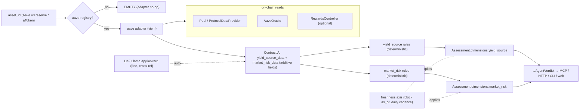

# feat: Yield-source provenance + market-risk dimensions (Aave v3 lending adapter)

## Summary

Generalize the engine from "is the backing real?" to "where does this yield come from, and where does proof stop?" — starting with fully on-chain lending markets (Aave v3). This adds **two new deterministic dimensions** to the Assessment, both additive to the frozen contracts and both keeping the existing three-axis honesty (`flag` × `confidence` × `freshness`, un-collapsible, no faked greens):

- **`yield_source`** — decomposes an asset's yield into **organic** (borrow interest, computed from the pool's on-chain rate) vs. **inflationary** (reward emissions), classifies the source, and names the trust boundary.
- **`market_risk`** — the differentiator vs. DeFiLlama: reads the reserve's actual on-chain risk state (utilization, bad debt / deficit, collateralization buffer, caps, oracle source, freeze/pause, available liquidity) and grades it honestly, marking `unknown` where a signal can't be derived.

The verification value (not the number itself — DeFiLlama already reports `apyBase`/`apyReward`) is: numbers **read from chain and re-derivable** rather than trusted from an aggregator, plus a **risk read DeFiLlama does not provide**, delivered as an agent-consumable verdict. One adapter covers every Aave v3 reserve; the shape generalizes to Morpho and other sources as follow-ups.

---

## Problem Frame

The tool today verifies **backing** for RWA tokens. Its yield handling is limited to an aggregator-reported `yield_apy` field (DeFiLlama adapter, `auto` confidence). It says nothing about *where a yield comes from* or *what the market risk is* — which is the actual question for DeFi yield.

DeFiLlama already provides organic-vs-reward APY and TVL, so a decomposition-only adapter would be redundant. The unmet need is **verification** (on-chain-derived, re-checkable) and **risk** (bad debt, collateralization, oracle dependency, freeze state) surfaced as a structured, un-collapsible verdict an agent can gate on. Lending is the first target because every signal is on-chain and one adapter covers all Aave v3 markets.

**Success criteria:**
- Given an Aave v3 reserve/aToken, the verdict includes a `yield_source` dimension (organic vs. inflationary split, source kind, trust boundary) and a `market_risk` dimension (on-chain risk read), both computed deterministically from chain state.
- Green means *verified organic yield* / *low on-chain risk*, resting only on on-chain arithmetic — never a safety guarantee, never faked. `unknown` is a valid outcome for any signal that can't be derived.
- Frozen/paused reserves, present bad debt, and emissions-dominated yields are never graded as a clean organic green.
- The existing backing/redemption/access/structure verdict, contracts, and all current tests are unchanged (additive only).

---

## Requirements

- **R1** — Add two dimensions (`yield_source`, `market_risk`) to Contract B additively; existing `DimensionKey`s and consumers keep working.
- **R2** — Add an Aave v3 ingestion adapter that reads reserve state on-chain via viem and contributes new Contract A fields additively.
- **R3** — Deterministic scoring only (no LLM in computation); every green rests on on-chain arithmetic; `parse_confidence`-style floors do not apply because there is no LLM extraction in this path (extraction is `onchain_read` → `verified`).
- **R4** — Compose with the existing **freshness** axis (on-chain reads → `oracle_por`/`onchain_holdings`-class cadence) and the **anti-laundering** principle (yield on an unverified underlying cannot claim more certainty than the underlying).
- **R5** — Deep, thorough `market_risk` model over all on-chain-derivable signals; honestly `unknown` for signals that require off-chain data (audits, exploit history) — those are explicitly deferred.
- **R6** — Agent-facing: the two new dimensions appear in `AgentVerdict.dimensions` (already generic) and are documented in the JSON schema + INTEGRATIONS; never collapse to a boolean.
- **R7** — Human-gated registry for Aave markets/reserves (addresses verified before shipping, mirroring `edgar-registry.ts` discipline).

---

## Key Technical Decisions

- **KTD1 — Two new dimensions, not a separate verdict.** `yield_source` and `market_risk` join `backing/redemption/access/structure` in `Assessment.dimensions`. Rationale: one contract, one surface, and `toAgentVerdict` already maps `dimensions` generically, so the agent/HTTP/CLI/web surfaces get them almost for free. Keeps the frozen contract additive.
- **KTD2 — Aave v3 read via the canonical periphery contracts.** Use `PoolAddressesProvider` → `Pool` + `AaveProtocolDataProvider` + `AaveOracle`. `AaveProtocolDataProvider.getReserveData` / `getReserveConfigurationData` / `getReserveCaps` / `getPaused` and `AaveOracle.getAssetPrice` expose every signal we need in a few `readContract` calls. Rationale: stable, documented periphery; no per-reserve address guessing beyond the registry's provider + underlying.
- **KTD3 — Organic APY from the pool rate; emissions cross-referenced.** Organic supply APY is derived from the reserve's `liquidityRate` (ray → APY, deterministic arithmetic). Reward emissions come from the Aave `RewardsController` if present, else cross-referenced against DeFiLlama's `apyReward` (free, keyless) and labeled `auto`. Rationale: the organic number is the verifiable core (`verified`); emissions are the softer signal (`auto`), and the split is the honest output.
- **KTD4 — Green rests on on-chain arithmetic only.** `yield_source` green = "yield is ≥ organic threshold of total and the organic rate is an on-chain read." `market_risk` green = "no bad debt, healthy utilization, active/un-frozen, oracle present, within caps." Both are re-derivable; neither is a safety claim. No LLM anywhere in this path.
- **KTD5 — Honest `unknown` is first-class.** Any signal that can't be read (e.g., bad debt when the running version lacks a `deficit` accessor, or reward data when neither RewardsController nor DeFiLlama resolves) is `unknown`, never assumed benign. A dimension with only `unknown` signals reports `unknown`.
- **KTD6 — Anti-laundering composition.** If the reserve's underlying asset is itself tokenized and its backing is not verified, `market_risk` cannot exceed the underlying's ceiling (you cannot be safer than the thing you lent). Reuse the existing ceiling concept from backing rather than reinventing it.
- **KTD7 — Deep risk now; off-chain risk deferred.** v1 risk = all on-chain-derivable signals (below). Audit coverage, exploit history, and governance/admin-key risk require off-chain sources and are deferred with an explicit `unknown`/roadmap note — not silently omitted.

---

## High-Level Technical Design

Directional only; prose and per-unit fields are authoritative.

---

## Implementation Units

### U1. Additive contract types for yield-source + market-risk

**Goal:** Extend Contracts A and B additively with the types the new dimensions need. No existing field repurposed.
**Requirements:** R1, R3.
**Dependencies:** none.
**Files:** `lib/contracts.ts`, `lib/contracts.test.ts` (or extend an existing contracts-level test if present).
**Approach:**
- Add `"yield_source"` and `"market_risk"` to `DimensionKey`.
- Add enums: `YieldSourceKind` (`lending_interest | staking | amm_fees | perp_funding | rwa_coupon | emissions | mixed | unknown`) and a `RiskSignalLevel` (`ok | caution | critical | unknown`) for per-signal grading.
- Add additive `FieldName`s / a structured record for the raw reads (e.g. `yield_source_data`, `market_risk_data`) OR carry them as new optional fields on `NormalizedAssetRecord` (`yield_source_data?`, `market_risk_data?`) — prefer a typed optional field object so the frozen `FieldMap` is untouched. Include: `organic_apy`, `reward_apy` (nullable), `utilization`, `available_liquidity`, `supply_cap`/`borrow_cap` + current totals, `ltv`, `liquidation_threshold`, `reserve_factor`, `is_frozen`/`is_paused`/`is_active`, `oracle_source`, `deficit`/bad-debt (nullable), each carrying its own `as_of` + `confidence`.
- `DimensionAssessment` already carries `flag/confidence/freshness/reason/inputs/sources` — reuse as-is; the new dimensions produce the same shape.
**Patterns to follow:** the additive style already used for `EXPECTED_CADENCE_MS`, `Freshness`, and `EvidenceItem.cadence_ms`; keep the "Do not reshape; add fields additively" rule at the top of `lib/contracts.ts`.
**Test scenarios:**
- Type-level: a `NormalizedAssetRecord` without the new fields still satisfies the type (optional) — existing fixtures compile unchanged.
- `DimensionKey` union includes the two new keys; `computeAssessment`'s dimensions map type accepts them (compile check).
- Test expectation: light — this is mostly types; one assertion that `EXPECTED_CADENCE_MS`-style additions didn't change existing enum members.
**Verification:** `npx tsc --noEmit` passes; all existing tests green with no edits.

### U2. Aave v3 registry (human-gated)

**Goal:** Map an `asset_id` to its Aave v3 market so the adapter never guesses addresses.
**Requirements:** R2, R7.
**Dependencies:** none.
**Files:** `lib/ingestion/adapters/aave-registry.ts`, `lib/ingestion/adapters/__tests__/aave-registry.test.ts`.
**Approach:**
- `AaveMarketEntry { chainId, poolAddressesProvider, underlying, aToken, label, verified_at, verified_against }` keyed by canonical `asset_id` (both the aToken and the underlying may map to the same reserve).
- Seed 2–3 verified Ethereum v3 reserves (e.g. USDC, WETH) with addresses confirmed against Aave's address book; `verified_against` records the source URL.
- `lookupAaveMarket(assetId)` returns the entry or `undefined`. Empty-by-default discipline: no unverified entry ships (mirror `edgar-registry.ts` / `attestation-registry.ts`).
**Patterns to follow:** `lib/ingestion/adapters/edgar-registry.ts` (provenance fields, integrity note, lookup fn).
**Test scenarios:**
- Known aToken and known underlying both resolve to the same market entry.
- Unknown asset returns `undefined`.
- Every seeded entry carries a `verified_at` and a `poolAddressesProvider` + `underlying` (guard against half-filled rows).
**Verification:** lookups resolve for seeded assets; test asserts no entry is missing required provenance.

### U3. Aave v3 ingestion adapter (viem reads → Contract A)

**Goal:** Read the reserve's on-chain state and emit the additive `yield_source_data` + `market_risk_data`. Split pure shaping from network I/O for testability.
**Requirements:** R2, R3, R4.
**Dependencies:** U1, U2.
**Files:** `lib/ingestion/adapters/aave.ts`, `lib/ingestion/aave.ts` (pure shaping helpers — ray→APY, utilization, config decode), `lib/ingestion/__tests__/aave.test.ts`, fixture `lib/ingestion/__tests__/fixtures/aave-usdc-reserve.json`.
**Approach:**
- `aaveAdapter(asset)`: registry lookup → `EMPTY` if absent (instant, keeps the long-tail path fast, mirrors `edgarAdapter`/`attestationAdapter`).
- Resolve `Pool` + `AaveProtocolDataProvider` from `PoolAddressesProvider`; read `getReserveData` (rates, aToken supply, total debt, liquidity index, timestamp), `getReserveConfigurationData` (LTV, liquidation threshold, reserve factor, active/frozen), `getPaused`, `getReserveCaps`, and `AaveOracle.getAssetPrice`. Read the running version's bad-debt/`deficit` accessor if present; else leave `deficit = null` (→ `unknown` downstream).
- Optionally read `RewardsController` emissions; else fetch DeFiLlama `apyReward` for the pool (keyless) → `reward_apy` at `auto`.
- Pure helpers in `lib/ingestion/aave.ts` (network-free, fixture-tested): `rayRateToApy`, `utilizationOf`, `decodeReserveConfig`, `buildYieldSourceData`, `buildMarketRiskData`. All numeric shaping that can flip a flag is unit-tested against the fixture (mirrors `parseNmfp` in `lib/ingestion/edgar.ts`).
- Each emitted field carries `as_of` = reserve `lastUpdateTimestamp`/block time and `confidence: verified` for on-chain reads (`auto` for the DeFiLlama reward cross-ref).
**Patterns to follow:** `lib/ingestion/adapters/edgar.ts` (network shell + pure parser split), `lib/ingestion/adapters/onchain.ts` (viem `readContract` usage), graceful `EMPTY` on failure.
**Test scenarios (pure helpers, no network):**
- `rayRateToApy` converts a known `liquidityRate` ray to the expected APY within tolerance.
- `utilizationOf` = totalDebt / totalSupplied; 0-supply → 0 (no div-by-zero).
- `decodeReserveConfig` extracts LTV, liquidation threshold, active/frozen from a fixture config.
- `buildYieldSourceData` produces `organic_apy` (verified) and `reward_apy` null when no reward source; `mixed`/`emissions` kind when reward dominates.
- `buildMarketRiskData` maps a frozen reserve to a critical `is_frozen` signal; a healthy fixture to `ok` signals; a missing `deficit` to `unknown`.
- Adapter returns `EMPTY` for an unregistered asset without any network call.
**Verification:** fixture-driven helper tests pass; a manual run against the live RPC for a seeded reserve produces sane values (recorded in the PR, not asserted in CI).

### U4. `yield_source` deterministic scoring

**Goal:** Turn `yield_source_data` into a dimension verdict: organic vs. inflationary split, source kind, trust boundary, honest `unknown`.
**Requirements:** R3, R4, R5.
**Dependencies:** U1, U3.
**Files:** `lib/computation/yield-source.ts`, `lib/computation/__tests__/yield-source.test.ts`.
**Approach:**
- `assessYieldSource(record)` → `DimensionAssessment` (+ `freshness`).
- Compute `organic_share = organic_apy / (organic_apy + reward_apy)` when reward is known; if reward unknown, report the organic rate but flag the emissions portion `unknown` (do not assume 0).
- Flag rules (deterministic): `green` when yield is ≥ an organic-share threshold **and** the organic rate is an on-chain read (`verified`); `amber` when emissions are a material share or reward data is `auto`; `red` reserved for a contradiction (e.g. organic rate reads 0 but headline APY is nonzero — a data-integrity red); `unknown` when neither organic nor reward can be read.
- `reason` names the split in plain words ("~3.1% organic borrow interest + ~9% emissions" or "organic verified; emissions unverified"). `trust_boundary`: "Yield is real on-chain interest; the aToken's value still depends on pool solvency and the collateral oracle — see market risk."
- Apply `applyFreshness` using the reserve read's `as_of` (cadence: daily-class). Compose anti-laundering: if the underlying is an unverified token, cap confidence/flag accordingly (KTD6).
**Patterns to follow:** `lib/computation/backing.ts` (`build`, `applyFreshness`, deterministic flag rules), `lib/computation/freshness.ts`.
**Test scenarios:**
- Organic-dominated, reward known → `green`/`verified`, reason states the split.
- Emissions-dominated → `amber`, kind `emissions`/`mixed`, not green.
- Reward data unavailable → organic reported but emissions `unknown`; overall not green.
- Organic rate 0 with nonzero headline → `red` (integrity), reason flags the contradiction.
- No readable rates → `unknown` (not green, not red).
- Stale read (as_of beyond cadence) → freshness demotes per the axis; a stale green carries a caveat.
- Underlying unverified → flag/confidence ceilinged (anti-laundering).
**Verification:** all scenarios pass; no path yields green without an on-chain organic read.

### U5. `market_risk` deterministic scoring (the deep risk model)

**Goal:** Grade the reserve's on-chain risk honestly across every derivable signal; `unknown` where a signal needs off-chain data.
**Requirements:** R3, R4, R5, R7.
**Dependencies:** U1, U3.
**Files:** `lib/computation/market-risk.ts`, `lib/computation/__tests__/market-risk.test.ts`.
**Approach:** compute a per-signal `RiskSignalLevel`, then a dimension flag = worst material signal (deterministic, explainable), with `unknown` signals excluded from "green" but surfaced in `reason`/caveats. Signals (all on-chain now):
- **Bad debt / deficit** — present deficit → `critical` (red). Not derivable on the running version → `unknown` (never assumed 0).
- **Utilization** — banded: healthy < ~80% `ok`; 80–95% `caution` (withdrawal risk); > ~95% `critical` (liquidity crunch). Pair with `available_liquidity`.
- **Collateralization buffer** — `liquidation_threshold − ltv`; thin buffer → `caution`. (Reserve-level config, not per-borrower solvency — state that boundary.)
- **Caps proximity** — supply/borrow totals near caps → `caution`.
- **Reserve state** — `is_frozen`/`!is_active` → `critical` (red); `is_paused` → `critical`.
- **Oracle dependency** — `oracle_source` present → name it as the trust boundary; absent/zero price → `critical`/`unknown`. The oracle is the single point of failure for collateral valuation; it is named, not hidden.
- Overall flag: any `critical` → `red`; else any `caution` → `amber`; all `ok` (with no blocking `unknown`) → `green`; only `unknown` → `unknown`. `reason` enumerates the driving signals; `trust_boundary` names the oracle + "reserve-level config, not a per-borrower solvency proof."
- Apply freshness (block `as_of`, daily cadence) and anti-laundering ceiling.
- **Deferred signals (explicit `unknown` + roadmap note, not silent):** audit coverage, exploit history, governance/admin-key/upgradeability risk — require off-chain sources.
**Patterns to follow:** `lib/computation/backing.ts` band/flag style; `downgradeFlag`, `applyFreshness`.
**Test scenarios:**
- Healthy fixture (low utilization, active, oracle present, no deficit) → `green`.
- Frozen reserve → `red`, reason names the freeze.
- Utilization 97% → `red` (liquidity), 85% → `amber`.
- Present deficit → `red`; deficit unreadable → contributes `unknown`, overall not green.
- Missing oracle price → `red`/`unknown`, trust boundary names the oracle.
- Thin collateral buffer → `amber` with the reserve-level caveat.
- All-`unknown` inputs → `unknown` dimension (not a false green).
- Stale read → freshness demotion + caveat; underlying unverified → ceiling applied.
**Verification:** every scenario passes; no green while any `critical` or blocking `unknown` is present.

### U6. Wire dimensions into the assessment, adapter pipeline, and surfaces

**Goal:** Make the two dimensions flow end-to-end without disturbing existing behavior.
**Requirements:** R1, R2, R6.
**Dependencies:** U3, U4, U5.
**Files:** `lib/computation/index.ts`, `lib/ingestion/index.ts`, `lib/agent/schema.ts`, `lib/display.ts`, `components/DimensionRow.tsx` usage in `components/RiskCard.tsx`, `docs/INTEGRATIONS.md`; tests: `lib/computation/__tests__/index.test.ts` (or extend), `lib/agent/__tests__/schema.test.ts`.
**Approach:**
- `computeAssessment`: add `yield_source: assessYieldSource(record)` and `market_risk: assessMarketRisk(record)` to the dimensions map; `overall_confidence` logic already ignores `unknown` dimensions, so non-lending assets (which produce `unknown` here) don't regress.
- `ingestQuant`: add `aaveAdapter(parsed)` to the `Promise.all` (registry-gated → instant `EMPTY` for non-Aave assets), and push its contributions into the record.
- `lib/agent/schema.ts`: the `dimensions` schema is `additionalProperties` over a generic dimension shape, so new keys validate automatically — extend the drift test to assert the two new keys appear for a lending fixture. Add `DIMENSION_TITLES` entries in `lib/display.ts`.
- Web card: render the two new dimension rows (reuse `DimensionRow` + the freshness pill).
- `INTEGRATIONS.md`: document the two dimensions and note they are `unknown` for non-lending assets.
**Patterns to follow:** how `edgar`/`attestation` adapters were added to `ingestQuant`; how `DimensionRow` already renders dimensions generically.
**Test scenarios:**
- A seeded Aave asset's assessment contains `yield_source` and `market_risk` dimensions with non-`unknown` flags (integration, using the fixture path, not live network).
- A non-lending asset (e.g. BENJI) still produces the original four dimensions and now two `unknown` ones, and `overall_confidence` is unchanged (regression guard).
- `toAgentVerdict` exposes both new dimensions; schema drift test still passes and asserts the new keys for the lending fixture.
- Covers R6: verdict never collapses to a boolean; new dimensions carry their own caveats.
**Verification:** full suite green; BENJI/OUSG verdicts unchanged except for two added `unknown` dimensions; `npm run build` compiles.

### U7. Honesty invariants + canary (cross-cutting guard)

**Goal:** Lock the "never fake a green, unknown is valid" contract for the new dimensions the way `seed-options`/`attestation` invariants lock backing.
**Requirements:** R3, R5.
**Dependencies:** U4, U5, U6.
**Files:** `lib/computation/__tests__/yield-risk-invariants.test.ts`.
**Approach:** assert the cross-cutting rules in one place: (a) no `yield_source` green without a `verified` on-chain organic read; (b) no `market_risk` green while any `critical` or blocking `unknown` signal is present; (c) an emissions-dominated pool never reads organic-green; (d) a frozen reserve is always `red`; (e) both dimensions honor freshness demotion; (f) anti-laundering ceiling holds when the underlying is unverified. A lending fixture that flips one input per case.
**Patterns to follow:** `lib/computation/__tests__/confidence-cap.test.ts`, the attestation anti-dilution invariants.
**Test scenarios:** one per rule (a)–(f) above, each asserting the guard fires.
**Verification:** invariant suite green; deliberately breaking a rule in a scratch edit makes exactly the intended test fail.

---

## Scope Boundaries

**In scope:** Aave v3 lending on Ethereum (registry-seeded reserves), the two new dimensions, deep on-chain risk, additive contract changes, agent/HTTP/CLI/web exposure, tests + invariants.

### Deferred to Follow-Up Work
- **Morpho + other lending markets** — second adapter behind the same shape once Aave proves the pattern.
- **Other yield-source categories** — staking/LSTs, AMM fees, perp funding, delta-neutral, Pendle (per the roadmap table).
- **Composability / rehypothecation graph** — the "your 12% is 3% real + 9% recursive leverage" view; extends the anti-laundering ceiling.
- **Off-chain risk signals** — audit coverage, exploit history, governance/admin-key/upgradeability risk (need a data source; v1 marks these `unknown`).
- **Non-Ethereum Aave deployments** — registry can add other chains later.

### Outside this product's identity
- A boolean "safe to invest" score, portfolio/position management, or deposit execution — unchanged from the existing product stance.

---

## Risks & Dependencies

- **Aave version drift** — accessor availability (esp. bad-debt/`deficit`) varies by version. Mitigation: read defensively, `null → unknown`, never assume 0; pin the reserve read behind the registry's `poolAddressesProvider`.
- **DeFiLlama reward cross-ref is `auto`, not verified** — keep it clearly labeled and never let it lift a green; organic read is the only `verified` yield input.
- **Registry correctness is the false-green surface** — a wrong `poolAddressesProvider`/`underlying` could misread a reserve. Mitigation: human-gated registry with provenance (U2), same discipline as EDGAR.
- **RPC dependency** — uses the existing Alchemy `ETHEREUM_RPC_URL`; adapter degrades to `EMPTY` on RPC failure (honest `unknown`, never a fabricated read).
- **Dependencies:** viem (already used), the existing freshness axis, the existing `Promise.all` adapter pipeline, DeFiLlama yields API (keyless, optional).

---

## Sources & Research

- First-hand codebase context from this session: `lib/contracts.ts`, `lib/computation/backing.ts`, `lib/computation/freshness.ts`, `lib/ingestion/adapters/{edgar,attestation,onchain,defillama}.ts`, `lib/ingestion/index.ts`, `lib/agent/verdict.ts`, `lib/agent/schema.ts`.
- Aave v3 periphery (`PoolAddressesProvider`, `AaveProtocolDataProvider`, `AaveOracle`, `RewardsController`) as the on-chain read surface.
- DeFiLlama yields API (`apyBase`/`apyReward`) as a keyless cross-reference for the emissions split — and the explicit reason this adapter must add verification + risk rather than re-report aggregated numbers.
