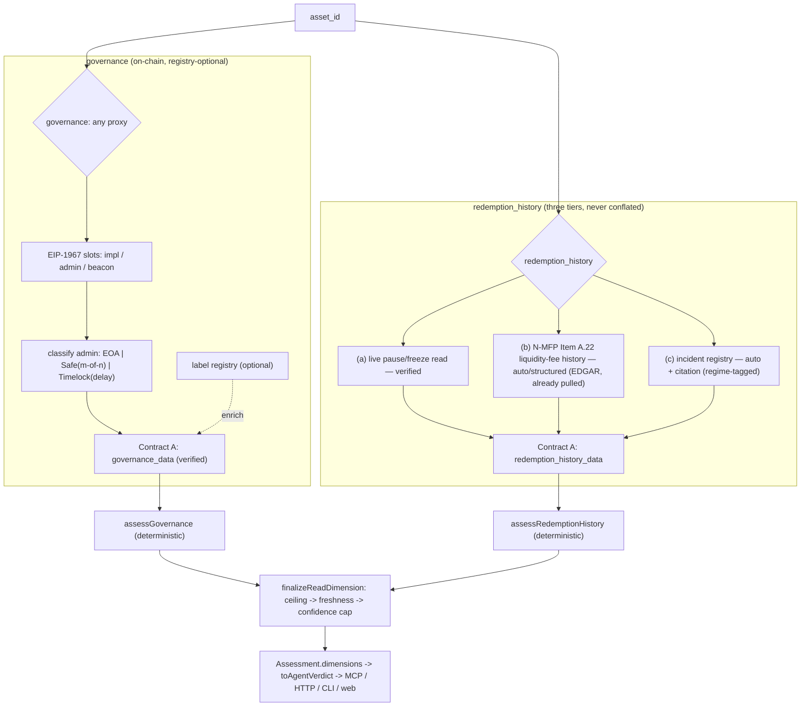

# feat: Redemption-restriction history + governance/admin-key risk dimensions

## Summary

Add **two new deterministic dimensions** to the Assessment, built on the exact pattern the shipped `yield_source`/`market_risk` dimensions established (`DimensionRead` + `finalizeReadDimension` + human-gated registry + pure-shaping-split-from-network-shell + honesty invariants). Both are additive to the frozen contracts, both compose with the freshness axis and the anti-laundering ceiling, and both hold the "no faked greens / `unknown` is first-class / re-derivable" contract.

- **`governance`** — the "who can change the rules?" on-chain read. Derives upgradeability and control from public RPC data: EIP-1967 proxy slots, the admin/owner behind them, whether that admin is an EOA, a Gnosis Safe (owner set + threshold), or a `TimelockController` (delay + roles), and any pause/guardian power. Fully on-chain, `verified`, re-derivable. Unlike the other dimensions it is **registry-optional** — it works on any proxy, so it reaches the long tail.
- **`redemption_history`** — the redemption-*restriction* track record ("has getting out ever been blocked?"), distinct from the existing point-in-time `redemption` policy dimension. This is the sharpest competitive wedge: rwa.xyz has **no** gate/freeze/suspension history field at all. It is a **three-signal, honestly-tiered** dimension — a live on-chain pause/freeze read (`verified`), a registered-MMF liquidity-**fee** history parsed from N-MFP filings the engine already fetches (`auto`/structured), and a human-gated incident registry for everything filings can't cleanly express (`auto` + citation). The three are never conflated; each is labeled by its verification means.

The strategic frame (validated with the requester): in DeFi you either **show more** (earn trust by exposing re-derivable proof) or **show less** (abstract for TradFi/consumers) — the middle is dead. This engine is the "show more" substrate; a "show less" consumer surface can be collapsed down from it later, never the reverse.

---

## Problem Frame

The engine verifies backing, yield source, and on-chain market risk. Two high-value questions remain unasked, and the competitive scan (2026) shows nobody occupies either honestly:

1. **"Who can change or seize this?"** No live, independent, cross-protocol "who can rug this" read exists — OpenZeppelin Defender is being sunset (July 2026). Admin-key/upgradeability/governance control is the risk retail most ignores and is fully on-chain-derivable (EIP-1967 slots, timelock delay, Safe threshold).
2. **"Has redemption ever been blocked?"** The market-leading RWA index (rwa.xyz, confirmed by direct fetch) has fields for redemption *frequency* and *minimum* but **no gate/freeze/suspension history field**. The November 2025 DeFi contagion and the BREIT/SREIT repurchase-gate precedents show this is exactly the signal that matters when it matters — and it is not surfaced anywhere.

Both are re-derivable from primary sources (on-chain reads; SEC filings the engine already pulls; a cited incident registry), so both fit the engine's identity: a green is something you can reproduce, and `unknown` is an honest answer, never a hidden failure.

**Success criteria:**
- A `governance` verdict grades upgradeability + control on-chain, `verified`, re-derivable; a single-key (EOA) admin over an upgradeable proxy is never green; an unrecognized control pattern is `unknown`, never a false green.
- A `redemption_history` verdict surfaces current restriction state + historical restriction incidents as **three distinct, differently-tiered signals**, never conflated into one number; a green means "not currently restricted and none on record as of {as_of}" (freshness-scoped), never "provably never restricted."
- For a registered MMF (BENJI class), the dimension honestly states that regulatory redemption *gates* are structurally impossible post-Oct-2023 and tracks liquidity-**fee** history instead.
- The existing four dimensions, both v1.2 dimensions, all contracts, and all current tests are unchanged (additive only). Non-covered assets report `unknown` for the two new dimensions and `overall_confidence` does not regress.

---

## Requirements

- **R1** — Add two dimensions (`governance`, `redemption_history`) to Contract B additively; existing `DimensionKey`s and consumers keep working.
- **R2** — `governance` reads control/upgradeability on-chain via viem and contributes additive Contract-A fields; runs **registry-optional** (works on any proxy address; an optional label registry only enriches provenance).
- **R3** — `redemption_history` composes three sources: (a) live on-chain pause/freeze state, (b) N-MFP liquidity-fee history (extend the existing EDGAR path), (c) a new human-gated incident registry. Each signal carries its own verification means and confidence tier and is surfaced distinctly.
- **R4** — Deterministic scoring only (no LLM in computation). Every green rests on a `verified` read (on-chain control read; on-chain current pause state). Filing-derived and registry-derived history are `auto` + citation and **can never mint a `verified` green** — they inform amber/red and caveats.
- **R5** — Compose with the existing **freshness** axis and **anti-laundering** ceiling via `finalizeReadDimension`. A `redemption_history` green is an *absence* claim and must be freshness-scoped and worded as such.
- **R6** — Agent-facing: both dimensions appear in `AgentVerdict.dimensions` (already generic), render on the web card only when non-`unknown`, and are documented in `docs/INTEGRATIONS.md`; never collapse to a boolean.
- **R7** — Honesty invariants locked in one place (like `yield-risk-invariants.test.ts`), including the never-conflate rule for the three redemption signals and the never-false-green rule for governance.
- **R8** — Human-gated registries carry provenance and a **regime** discriminator so a non-traded-REIT contractual repurchase cap is never presented as a '40-Act regulatory suspension (or vice versa).

---

## Key Technical Decisions

- **KTD1 — Two new dimensions, not folds.** `governance` stays distinct from `market_risk` (control risk ≠ market state); `redemption_history` stays distinct from the point-in-time `redemption` policy dimension (track record ≠ stated policy). Rationale: honest separation, and `toAgentVerdict` maps `dimensions` generically so the surfaces come almost free. (Resolved fork with requester.)
- **KTD2 — `redemption_history` is a three-signal, honestly-tiered dimension; the signals are never conflated.** (a) current on-chain pause/freeze = `verified`; (b) registered-MMF liquidity-fee history from N-MFP = `auto`/structured; (c) curated incident registry = `auto` + citation. They are *fundamentally different verification means* and the verdict must say so, differently valuable to different audiences. (Resolved fork with requester.)
- **KTD3 — Hybrid sourcing (current-state live + filing history + curated registry).** A cheap single live read (`paused()`/frozen now) sits in the hot path; interpreted *history* lives in the registry (the moat) plus the already-pulled N-MFP fee data. A full `eth_getLogs` history scan is **not** in the lookup path (slow, heterogeneous, blind to off-chain gates); it is an optional deferred enrichment that only *proposes* registry entries for human review. (Resolved fork with requester.)
- **KTD4 — MMF gates are structurally dead post-Oct-2023; track fees, and say so.** The 2023 MMF reform (Release IC-34959; rule effective Oct 2, 2023) removed redemption gates from Rule 2a-7 entirely. For a registered MMF, "has it ever gated" is a *historical-only* question, and the live signal is the **mandatory/discretionary liquidity fee** reported in **N-MFP Item A.22** (reporting consolidated onto N-MFP as of June 11, 2024). The dimension states this honestly rather than pretending to detect an impossibility. (Load-bearing external research — see Sources.)
- **KTD5 — A `redemption_history` green is an absence claim, freshness-scoped.** Green means "not currently restricted, and no restriction on record as of {as_of}" — never "provably never restricted." Absence of evidence is labeled as exactly that, and the freshness axis ages the claim.
- **KTD6 — `governance` is registry-optional.** It reads EIP-1967 slots and the admin/owner on the asset's own contract, so it works on any proxy without a per-asset registry — the one dimension that reaches the long tail. An optional label registry maps known controllers (e.g., a known governance timelock or Safe) to human labels for provenance; its absence only costs a label, never correctness.
- **KTD7 — Regime discrimination is mandatory.** Non-traded REITs (BREIT/SREIT) impose *contractual* repurchase-plan caps, a different legal regime from '40-Act §22(e) redemption suspensions. The incident registry schema carries a `regime` field and the verdict names it; the two are never conflated. (Load-bearing external research.)
- **KTD8 — Reuse everything.** `DimensionRead`, `finalizeReadDimension`/`unknownDimension` (`lib/computation/dimension.ts`), the human-gated registry discipline (`edgar-registry.ts`/`aave-registry.ts`), the pure-shaping-split-from-network-shell (`lib/ingestion/aave.ts` vs `adapters/aave.ts`), and the invariant-test pattern. No new machinery unless a gap is proven.

---

## High-Level Technical Design

Directional only; prose and per-unit fields are authoritative.

---

## Implementation Units

### U1. Additive contract types for governance + redemption_history

**Goal:** Extend Contracts A and B additively with the types both dimensions need. No existing field repurposed.
**Requirements:** R1, R4.
**Dependencies:** none.
**Files:** `lib/contracts.ts`, `lib/ingestion/adapters/base.ts` (additive `AdapterResult` fields).
**Approach:**
- Add `"governance"` and `"redemption_history"` to `DimensionKey` — **deferred to the wiring unit (U8)** so the union edit lands atomically with `computeAssessment` gaining both dimensions (mirrors how the v1.2 plan avoided a broken build between units). U1 adds only the enums, data types, and optional record fields.
- Enums: `ProxyPattern` (`transparent | uups | beacon | none | unknown`), `AdminType` (`eoa | multisig | timelock | contract_unknown | none | unknown`), `RestrictionKind` (`gate | suspension | liquidity_fee | repurchase_cap | pause | unknown`), `RestrictionRegime` (`mmf_2a7 | ic40_open_end | non_traded_reit | onchain_contract | unknown`).
- `GovernanceData`: `proxy_pattern`, `is_upgradeable` (bool), `admin_type`, `admin_address`, `multisig_threshold`/`multisig_owner_count` (nullable), `timelock_delay_seconds` (nullable), `pause_power` (bool/nullable), `admin_label` (optional from registry) — each scalar a `DimensionRead` so an unreadable signal is `unknown`, never benign.
- `RedemptionHistoryData`: `current_paused` (`DimensionRead<boolean>`), `current_frozen` (`DimensionRead<boolean>`), `fee_events` (array of `{ as_of, kind: liquidity_fee, mandatory: boolean, amount_pct, source, citation }` from N-MFP), `incidents` (array of `{ as_of, kind: RestrictionKind, regime: RestrictionRegime, resolved_at?, source, citation, note }` from the registry), plus an `underlying_ceiling?` for anti-laundering. Reuse `DimensionRead` for the live on-chain signals; the fee/incident arrays carry their own per-item provenance + citation.
- Add optional `governance_data?` and `redemption_history_data?` to `NormalizedAssetRecord`; add the same two optional payloads to `AdapterResult`.
**Patterns to follow:** the additive v1.2 section already in `lib/contracts.ts` (`DimensionRead`, `YieldSourceData`, `MarketRiskData`); the `AdapterResult` additive fields for `yield_source_data`/`market_risk_data`.
**Test scenarios:**
- Type-level: existing fixtures/records without the new fields still satisfy the types (optional); `npx tsc --noEmit` passes with no existing test edits.
- A record carrying the new optional fields type-checks; enums include the intended members.
- Test expectation: light — mostly types; one assertion that the new enums/members exist and existing enum members are unchanged.
**Verification:** `npx tsc --noEmit` passes; full suite green with no edits.

### U2. Governance on-chain reader (viem reads -> Contract A)

**Goal:** Read a contract's upgradeability + control state on-chain and emit `governance_data`. Split pure shaping (pattern/admin classification) from network I/O.
**Requirements:** R2, R4.
**Dependencies:** U1.
**Files:** `lib/ingestion/adapters/governance.ts` (network shell), `lib/ingestion/governance.ts` (pure helpers: `classifyProxyPattern`, `classifyAdmin`, `buildGovernanceData`), `lib/ingestion/__tests__/governance.test.ts`, fixtures under `lib/ingestion/__tests__/fixtures/` (e.g. `governance-eoa-proxy.json`, `governance-timelock-multisig.json`, `governance-immutable.json`).
**Approach:**
- Read EIP-1967 slots (`implementation`, `admin`, `beacon`) via `getStorageAt`; detect Transparent/UUPS/Beacon vs. non-proxy. If not a recognized proxy → `proxy_pattern: none/unknown`, `is_upgradeable` accordingly.
- Resolve the admin/owner: try the EIP-1967 admin slot, then `owner()`/`getOwners()` heuristics. Classify the admin address: is it a contract? If it exposes Gnosis Safe methods (`getThreshold`/`getOwners`) → `multisig` + read threshold/owner count. If it exposes `TimelockController` methods (`getMinDelay`) → `timelock` + read delay. If it's an EOA (no code) → `eoa`. Else `contract_unknown`.
- Detect a pause/guardian power best-effort (`paused()` existence, `PAUSER_ROLE`/guardian patterns) → `pause_power`.
- Pure helpers do all shaping that can flip a flag (pattern decode from slot values, admin classification from probe results), fixture-tested like `parseNmfp`/`shapeAaveReserve`. On-chain reads are `verified`; unreadable/unrecognized → `null` → `unknown` downstream.
- `governanceAdapter(asset)`: reads the asset's own `contract_address`; no registry gate (KTD6). Optional label lookup enriches `admin_label`. Degrades to `EMPTY` on RPC failure.
**Patterns to follow:** `lib/ingestion/adapters/onchain.ts` (viem reads, `getStorageAt`/`getCode`, graceful `EMPTY`); `lib/ingestion/aave.ts` vs `adapters/aave.ts` (pure/shell split).
**Test scenarios (pure helpers, no network):**
- `classifyProxyPattern` maps fixture slot values to transparent/uups/beacon/none correctly; empty slots → `none`.
- `classifyAdmin`: EOA (no code) → `eoa`; Safe probe → `multisig` with threshold/owner count; Timelock probe → `timelock` with delay; unrecognized contract → `contract_unknown`.
- `buildGovernanceData`: immutable contract → `is_upgradeable: false`, admin `none`; upgradeable + EOA admin → the fields that will drive a critical downstream; unreadable slot → `null`/`unknown`.
- Adapter returns `EMPTY` on RPC failure without emitting a partial record.
**Verification:** fixture-driven helper tests pass; a manual live run against a known proxy (e.g. a seeded asset's token) and a known EOA-controlled contract produces sane values (recorded in the PR, not asserted in CI).

### U3. `governance` deterministic scoring

**Goal:** Grade upgradeability + control honestly; `unknown` where the pattern can't be read.
**Requirements:** R2, R4, R5.
**Dependencies:** U1, U2.
**Files:** `lib/computation/governance.ts`, `lib/computation/__tests__/governance.test.ts`.
**Approach:** per-signal grade then worst-material flag via `finalizeReadDimension`.
- **Immutable / renounced** (`is_upgradeable: false` or admin `none`) → `ok` (green-eligible): the rules can't be changed. Name it as the trust boundary.
- **Timelock control** with a meaningful delay (band, e.g. ≥ ~24–48h) → `ok`/`caution` (users can exit before a change lands); short/zero delay → `caution`.
- **Multisig control** → banded by threshold: healthy m-of-n (e.g. ≥ 2 and ≥ ~half) → `ok`/`caution`; 1-of-n or 1/1 → `critical`.
- **EOA admin over an upgradeable proxy** → `critical` (a single key can replace the implementation / seize). This is the flagship red.
- **Pause/guardian power** present → named as a control caveat (not itself critical unless combined with EOA/low-threshold control).
- **Unrecognized pattern** (`contract_unknown`, unreadable slots) → `unknown` (never a false green).
- Overall: any `critical` → red; any `caution` → amber; all `ok` (no blocking `unknown`) → green; only `unknown` → `unknown`. `reason` enumerates the driving control facts and names the trust boundary ("upgradeable via a 3-of-5 Safe behind a 48h timelock" / "single EOA can upgrade — no timelock, no multisig"). Compose freshness + anti-laundering via `finalizeReadDimension`.
**Patterns to follow:** `lib/computation/market-risk.ts` (per-signal grading + worst-material aggregation); `lib/computation/dimension.ts` (`finalizeReadDimension`, `unknownDimension`).
**Test scenarios:**
- Immutable/renounced → green; reason names immutability.
- EOA admin + upgradeable proxy → red; reason names the single-key upgrade power.
- 3-of-5 Safe behind a meaningful timelock → green/amber (per bands); reason names the structure.
- 1-of-1 multisig or zero-delay timelock → red/amber per bands.
- Unrecognized control pattern / unreadable slots → `unknown` (not green, not red).
- Stale read → freshness demotion + caveat; underlying unverified → ceiling applied.
- Overall never green while any `critical` or blocking `unknown` present.
**Verification:** all scenarios pass; no green without a `verified` control read; no false green on an unrecognized pattern.

### U4. Redemption current-state read + incident registry (Contract A, part 1)

**Goal:** The `verified` live signal and the curated-history signal for `redemption_history`.
**Requirements:** R3, R4, R8.
**Dependencies:** U1.
**Files:** `lib/ingestion/adapters/redemption-history.ts` (network shell for the live read + registry assembly), `lib/ingestion/adapters/redemption-registry.ts` (new human-gated incident registry), `lib/ingestion/redemption-history.ts` (pure shaping/merge helpers), tests + fixtures.
**Approach:**
- **Live current-state read (verified, hot path):** a single cheap read of `paused()`/frozen-equivalent on the asset's token contract (best-effort; absent → `null` → `unknown`, never assumed unpaused). One call, not a log scan.
- **Incident registry (human-gated, `auto` + citation):** `RedemptionIncidentEntry { assetId, kind, regime, as_of, resolved_at?, source, citation, note, verified_at, verified_against }`, keyed by canonical `asset_id`. Empty-by-default discipline (mirror `edgar-registry.ts`/`attestation-registry.ts`). Seed a small set of **verified** incidents with provenance, each carrying its **regime** (KTD7): e.g. a non-traded-REIT repurchase-cap example labeled `non_traded_reit` (BREIT/SREIT-class — clearly *contractual*, not '40-Act), and any verified tokenized-fund suspension. Do not seed unverifiable rumors.
- The optional deferred `eth_getLogs` enrichment is **out of scope for this unit** (Scope Boundaries) — it only ever proposes registry entries for human review.
**Patterns to follow:** `edgar-registry.ts` (provenance fields, empty-by-default, lookup fn); `lib/ingestion/adapters/onchain.ts` (single cheap read + graceful degrade).
**Test scenarios:**
- Live read: a contract exposing `paused()` true → `current_paused: true` verified; absent → `null` (unknown), never `false`.
- Registry: a seeded incident resolves by `asset_id`; unknown asset → no incidents; every seeded entry carries `kind`, `regime`, `source`, `citation`, `verified_at` (guard against half-filled rows).
- Regime is preserved verbatim (a `non_traded_reit` entry never surfaces as a '40-Act suspension).
**Verification:** live read + registry lookups behave; provenance/regime completeness asserted; adapter degrades to `EMPTY`/empty incidents without throwing.

### U5. N-MFP liquidity-fee history extraction (Contract A, part 2)

**Goal:** Extract registered-MMF liquidity-fee history from the N-MFP filing the engine already fetches.
**Requirements:** R3, R4.
**Dependencies:** U1, U4.
**Files:** `lib/ingestion/edgar.ts` (extend `parseNmfp` / add a fee-history extractor), `lib/ingestion/adapters/edgar.ts` (emit `redemption_history_data.fee_events`), tests + an N-MFP fixture extended with the fee item.
**Approach:**
- Extend the existing N-MFP parse to read **Item A.22** liquidity-fee events (per period: date, mandatory vs. discretionary, amount as % of shares redeemed). Emit them as `fee_events` at `auto`/structured confidence with the filing as `source` and the relevant span as `citation`.
- **Execution-time confirmation (deferred unknown):** the exact XML tag/element (`LIQUIDITYFEEREPORTINGPER` and Item A.22 labeling) is corroborated-but-not-directly-verified (SEC PDFs 403'd during research). Confirm the tag byte-for-byte against a real filed N-MFP XML (via EDGAR full-text search / a fetched `primary_doc.xml`) before hardcoding; if the tag differs, adjust the parser — the design is unaffected.
- Honesty framing (KTD4): for a registered MMF, the emitted signal is **liquidity-fee** history; the scorer (U6) states that regulatory *gates* are structurally impossible post-Oct-2023, so absence of gates is not a green claim on its own.
- Pre-June-2024 fee/gate data is not reliably in N-MFP; treat missing history as `unknown` for those periods, not "never." Do not fabricate a pre-reform record.
**Patterns to follow:** `lib/ingestion/edgar.ts` `parseNmfp` (fixture-tested pure parse), `lib/ingestion/adapters/edgar.ts` (seriesId integrity guard before emitting).
**Test scenarios:**
- A fixture N-MFP with a liquidity-fee event → one `fee_event` with the right date/mandatory-flag/amount and a citation.
- A fixture with no fee event → empty `fee_events` (not a fabricated "never").
- SeriesId mismatch → nothing emitted (reuse existing integrity guard).
- Covers R4: fee events are `auto`, never `verified`.
**Verification:** fixture-driven parse tests pass; a manual run against BENJI's latest N-MFP produces sane fee history (or empty), recorded in the PR; exact tag confirmed against a real filing before merge.

### U6. `redemption_history` deterministic scoring

**Goal:** Compose the three signals into one verdict without conflating them; green is an absence claim, freshness-scoped.
**Requirements:** R3, R4, R5, R8.
**Dependencies:** U1, U4, U5.
**Files:** `lib/computation/redemption-history.ts`, `lib/computation/__tests__/redemption-history.test.ts`.
**Approach:**
- **Current state first:** `current_paused`/`current_frozen` true → **red** ("redemptions are currently restricted on-chain") — the strongest, `verified` signal.
- **Historical incidents / fees:** any registry incident or material fee event → **amber**, with the reason naming the kind, regime, date, and whether resolved ("suspended redemptions Nov 2025 (tokenized fund, resolved Jan 2026)"; "imposed a 1% mandatory liquidity fee on {date}"; "non-traded REIT repurchase cap gating since {date} — contractual, not a '40-Act suspension"). Never merge the three signals into one score; each appears with its own tier in the reason/caveats.
- **Green (absence, freshness-scoped):** not currently restricted **and** no incident/fee on record → green, worded exactly as "not currently restricted; no redemption restriction on record as of {as_of}." For a registered MMF, append the honest note that regulatory gates are structurally impossible post-Oct-2023 (so this tracks fees). Green confidence is capped at the min of the reads used — a green resting only on a `verified` live read + an *empty* registry/`auto` fee history is honest about what it did and didn't check.
- **Unknown:** neither current state nor any history is readable → `unknown`.
- Compose freshness (the registry/fee `as_of` ages the absence claim) + anti-laundering via `finalizeReadDimension`.
**Patterns to follow:** `lib/computation/market-risk.ts` (worst-material aggregation, off-chain-deferred scope caveat); `lib/computation/dimension.ts`.
**Test scenarios:**
- Currently paused on-chain → red; reason names the live restriction.
- Historical resolved suspension in registry, not currently restricted → amber; reason names kind/regime/date/resolution.
- Registered-MMF liquidity-fee event → amber; reason names the fee and the "gates structurally impossible post-2023" note.
- Non-traded-REIT repurchase cap → amber, labeled as contractual/regime-specific, never as a '40-Act suspension.
- No current restriction + empty history → green, worded as an absence-as-of-date claim (assert the wording is scoped, not absolute).
- Neither state nor history readable → `unknown` (not a false green).
- The three signals never collapse into one: a test asserts a fee event and a live-pause both appear distinctly in the verdict rather than as a single merged flag.
- Stale registry/fee `as_of` → freshness demotion + caveat; underlying unverified → ceiling applied.
**Verification:** all scenarios pass; no green that isn't absence-scoped; the three verification means remain distinct in the output.

### U7. Wire both dimensions end-to-end

**Goal:** Flow both dimensions through assessment, ingest, agent verdict, and surfaces without disturbing existing behavior.
**Requirements:** R1, R2, R3, R6.
**Dependencies:** U2, U3, U4, U5, U6.
**Files:** `lib/contracts.ts` (the deferred `DimensionKey` union edit), `lib/computation/index.ts`, `lib/ingestion/index.ts`, `lib/agent/__tests__/verdict.test.ts` (extend the hardcoded `assessment()` helper's dimensions literal — it enumerates all keys and will otherwise fail to compile), `lib/display.ts` (`DIMENSION_TITLES`), `components/RiskCard.tsx`, `docs/INTEGRATIONS.md`; tests: `lib/computation/__tests__/dimensions-wiring.test.ts` (extend).
**Approach:**
- Add `"governance"` and `"redemption_history"` to `DimensionKey` **atomically** with `computeAssessment` adding `governance: assessGovernance(record)` and `redemption_history: assessRedemptionHistory(record)`, and with the `verdict.test.ts` helper gaining both keys (the two compile-forcing sites identified in the v1.2 build).
- `ingestQuant`: add `governanceAdapter(parsed)` and `redemptionHistoryAdapter(parsed)` to the `Promise.all`; thread their `governance_data` / `redemption_history_data` onto the record (governance runs on every asset; redemption-history is registry/EDGAR/live-gated). N-MFP fee events flow through the existing EDGAR adapter's contribution.
- `DIMENSION_TITLES`: add "Governance & Control" and "Redemption Restriction History". `RiskCard.tsx`: render each new row only when its flag is not `unknown` (governance will be non-`unknown` for most proxies; redemption-history only for covered assets).
- `docs/INTEGRATIONS.md`: document both dimensions, the three-tier redemption sourcing, and that governance is registry-optional / redemption-history is `unknown` off-coverage.
**Patterns to follow:** the v1.2 wiring (`computeAssessment` additive dimensions; `ingestQuant` adapter threading; generic `toAgentVerdict`; conditional `RiskCard` rows).
**Test scenarios:**
- A proxy asset's assessment contains a non-`unknown` `governance` dimension (integration, fixture-driven, no live network).
- A registered-MMF/covered asset's assessment contains a non-`unknown` `redemption_history` dimension with the three signals represented.
- A non-covered, non-proxy asset still produces the original six dimensions and now two more (`governance` may be `unknown` if not a proxy; `redemption_history` `unknown`), and `overall_confidence` is unchanged (regression guard).
- `toAgentVerdict` exposes both new dimensions; the drift/wiring test asserts the new keys for the fixtures; verdict never collapses to a boolean.
- `npm run build` compiles.
**Verification:** full suite green; existing flagship verdicts unchanged except the added dimensions; build compiles.

### U8. Honesty invariants + canary (cross-cutting guard)

**Goal:** Lock the "never fake a green, never conflate, unknown is valid" contract for both dimensions in one place.
**Requirements:** R4, R5, R7, R8.
**Dependencies:** U3, U6, U7.
**Files:** `lib/computation/__tests__/gate-governance-invariants.test.ts`.
**Approach:** property-style assertions, canary-verified (breaking a rule fails exactly its block), mirroring `yield-risk-invariants.test.ts`:
- (a) No `governance` green without a `verified` on-chain control read; an unrecognized/unreadable pattern is `unknown`, never green.
- (b) An EOA admin over an upgradeable proxy is always `red` regardless of other signals.
- (c) No `redemption_history` green while `current_paused`/`current_frozen` is true.
- (d) A `redemption_history` green is always absence-scoped (wording asserts "as of {date}", never absolute) and never rests on an `auto`/registry signal alone claiming `verified`.
- (e) The three redemption signals never conflate: a fee event + a live-pause both surface distinctly.
- (f) Regime is never rewritten: a `non_traded_reit` incident never renders as a '40-Act suspension.
- (g) Both dimensions honor freshness demotion and the anti-laundering ceiling.
**Patterns to follow:** `lib/computation/__tests__/yield-risk-invariants.test.ts` (permutation-driven, one block per rule).
**Test scenarios:** one block per rule (a)-(g), each asserting the guard fires.
**Verification:** invariant suite green; deliberately breaking a rule in a scratch edit makes exactly the intended block fail.

---

## Scope Boundaries

**In scope:** the two new dimensions; on-chain governance reads (EIP-1967 / Safe / Timelock); the three-tier redemption-history sourcing (live pause read + N-MFP fee history + human-gated incident registry with regime tagging); additive contract changes; agent/HTTP/CLI/web exposure; honesty invariants; INTEGRATIONS docs.

### Deferred to Follow-Up Work
- **Deferred `eth_getLogs` history enrichment** — a background sweep that *proposes* registry incidents for human review; never in the lookup path, never auto-published.
- **A "show less" consumer/TradFi surface** — a collapsed badge/score built on top of this honest substrate (validated as the right direction, but a separate surface).
- **Governance label registry breadth** — seeding many known controllers (timelocks, Safes) for richer `admin_label` provenance; the dimension works without it.
- **Non-Ethereum governance/redemption coverage** — same shape, other chains later.
- **Deep governance semantics** — role-graph analysis, upgrade-history diffing, proposal/quorum modeling.

### Outside this product's identity
- A boolean "safe to invest" score, portfolio/position management, or deposit execution — unchanged from the existing product stance.
- Predicting *whether* a fund will gate or an admin will act — this reads verifiable state and record, not intent.

---

## Alternatives Considered

- **Fold admin-key into `market_risk` / redemption-history into `redemption`.** Rejected: control risk ≠ market state, and a restriction track record ≠ a stated point-in-time policy. Folding would conflate distinct verification means and muddy the honesty contract. (Resolved with requester.)
- **Live `eth_getLogs` history scan as the primary redemption source.** Rejected for the hot path: slow (paginated across provider block-range caps), heterogeneous (every contract's events differ; a `Paused` event ≠ a fund redemption gate), needs interpretation anyway, and blind to off-chain/TradFi gates — the most valuable cases. Kept only as deferred enrichment.
- **Registry-only redemption history (no live current-state read).** Rejected in favor of the hybrid: the cheap `verified` current-state read is high-signal and belongs in the hot path; the registry owns interpreted history.
- **A "gate detector" for MMFs.** Rejected as dishonest: regulatory gates are structurally impossible for MMFs post-Oct-2023; the honest signal is liquidity-fee history, and the verdict says so.

---

## Risks & Dependencies

- **N-MFP tag not directly verified** — the Item A.22 / `LIQUIDITYFEEREPORTINGPER` labels are corroborated, not byte-verified (SEC PDFs 403'd). Mitigation: confirm against a real filed N-MFP XML before hardcoding (U5); design is robust to the tag differing.
- **"Absence" greens are epistemically weak** — "no incident on record" ≠ "never happened." Mitigation: freshness-scoped wording enforced by invariant (d); the registry is human-gated with a review cadence.
- **Governance pattern heterogeneity** — custom proxy/admin schemes won't match standard probes. Mitigation: unrecognized → `unknown`, never a false green (invariant a); label registry is optional.
- **Regime conflation** — a REIT repurchase cap misread as a '40-Act suspension would be a false, misleading verdict. Mitigation: mandatory `regime` field + invariant (f).
- **Registry correctness is the false-verdict surface** — a wrong incident or a wrong regime misinforms. Mitigation: human-gated, provenance + citation required, empty-by-default (same discipline as EDGAR/attestation/Aave registries).
- **Dependencies:** viem (already used), the existing EDGAR N-MFP fetch/parse, the freshness axis, `finalizeReadDimension`, the `Promise.all` adapter pipeline, the Alchemy `ETHEREUM_RPC_URL`.

---

## Sources & Research

- First-hand codebase context (this session): `lib/contracts.ts`, `lib/computation/{dimension,freshness,market-risk,yield-source,util}.ts`, `lib/ingestion/{aave,edgar}.ts`, `lib/ingestion/adapters/{aave,aave-registry,edgar,edgar-registry,onchain,attestation-registry}.ts`, `lib/ingestion/index.ts`, `lib/agent/verdict.ts`, `lib/display.ts`, `components/RiskCard.tsx`, and the shipped v1.2 plan `docs/plans/2026-07-08-001-feat-yield-source-lending-adapter-plan.md`.
- **SEC MMF reform + N-MFP (load-bearing, shaped KTD4/KTD7):** 2023 Money Market Fund Reforms final rule (Release 33-11211 / IC-34959; Fed. Reg. 2023-15124) — gates removed from Rule 2a-7 (rule effective Oct 2, 2023); mandatory liquidity fee framework (compliance Oct 2, 2024); fee/gate reporting consolidated onto **N-MFP Item A.22** (compliance June 11, 2024). Rule 22e-4 liquidity program + confidential Form N-RN (unusable as a public signal). N-CEN carries no redemption-suspension incident field. Exact XML tag corroborated, not byte-verified.
- **Regime precedents:** BREIT (Blackstone) repurchase gating ~Nov 2022–Feb 2024; Starwood SREIT tightening 2023–2024, renewed suspension 2026 — both **non-traded REITs** (contractual repurchase caps), a different regime from '40-Act §22(e) suspensions.
- **Competitive scan (2026):** rwa.xyz has no gate/freeze/suspension history field (direct fetch); OpenZeppelin Defender sunset (July 2026) leaves no live "who can rug this" dashboard; incumbent risk firms (Chaos Labs "DeFi's Black Box", Oct 2025) publicly conceded the verifiability gap these dimensions close.
- **On-chain standards:** EIP-1967 (proxy storage slots), OpenZeppelin `TransparentUpgradeableProxy`/`UUPSUpgradeable`/`BeaconProxy`, `TimelockController` (`getMinDelay`), Gnosis Safe (`getThreshold`/`getOwners`).
