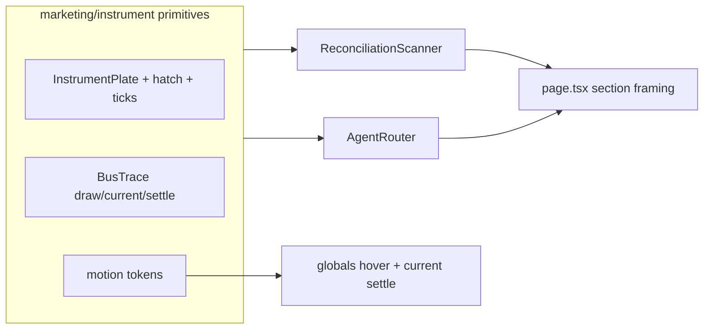

# feat: Rebuild marketing demos as schematic instruments

## Summary

Rebuild `ReconciliationScanner` and `AgentRouter` so they share the visual and motion language of `YieldExploder` / `Blueprints` — orthographic schematic plates, hairline connectors, corner ticks, hatch fills, heavy settle easings — instead of the current SaaS card-row + opacity-swap template. Soften sitewide card-lift hovers and event-drive blueprint current so ambient motion settles with the demos.

## Problem Frame

The landing page has one premium signature (`YieldExploder`: scroll-scrubbed isometric stack) and a coherent SVG blueprint vocabulary (`Blueprints.tsx`, audience glyphs). The two flagship “how it works” demos undermine that craft:

- Same shell: `.panel` → `rounded-2xl` cards → `.pill` tags → thin horizontal stubs → opacity text swaps
- Scanner reads as a dashboard comparison widget; Router promises a vault gate and delivers three Notion columns
- Page rhythm: Exploder breaks the grid, then both demos snap back to identical centered `max-w-4xl` embeds

Motion alone will not fix this — the primitives are wrong. Success = demos fail the “strip test”: without ticks/hatch/mono/connectors they look incomplete, same as Exploder.

## Requirements

- **R1** — Ban `rounded-2xl`, `.pill`, and equal SaaS card columns inside instrument demos.
- **R2** — Scanner becomes a dual-rail comparator plate: ON-CHAIN | die | FILING, hatch + corner ticks, orthogonal traces, match latch (not opacity footer tags as the primary signal).
- **R3** — Router becomes a gate mechanism: agent node → engine chip → vault posts/crossbar; approved lifts the bar, blocked drops/ghosts the path.
- **R4** — Motion primitives only: separate / draw / unmask / settle. Heavy `expo`/`power3`-class easings; no bounce springs; no opacity-only state swaps as the main beat.
- **R5** — Reuse existing ink: `FAINT`/`MID`/`SIGNAL`, `.trace` / `.current` / `.trace-node`, `.ticked`, 14px hatch, Exploder corner-tick geometry.
- **R6** — Soften `.card-link` / `.panel-link` hover: kill `translateY(-2px)`; one hairline/border signal only.
- **R7** — Event-drive `.current` where demos own it (flow while live, settle solid on match/approve); respect `prefers-reduced-motion`.
- **R8** — Section framing: break twin center-stacks (asymmetric copy + board, or full-bleed board) so demos don’t read as bolted-on Figma embeds.
- **R9** — Out of scope this pass: IntegrationGuide tabs, YieldSourceGrid pills, hero video, Exploder itself, AudienceCards full rebuild (optional light frame polish only if cheap).

## Key Technical Decisions

- **KTD1 — Orthographic companions, not a second isometric hero.** Scanner/Router stay flat schematic plates that share Exploder’s *ink* (ticks, hatch, mono, dashed connectors), not its 3D projection. One spatial signature per page.
- **KTD2 — Shared instrument primitives, not a third one-off.** Extract small shared pieces (`InstrumentPlate`, hatch style, corner ticks, bus `Trace`, motion tokens) under `components/marketing/` so both demos stay consistent and AudienceCards can adopt later.
- **KTD3 — Geometry carries state; text is secondary.** Match/approve/block must change stroke weight, gate height, latch, or plate border — not only `AnimatePresence` opacity on copy.
- **KTD4 — Motion tokens in one place.** `lib/motion.ts` (or `components/marketing/motion.ts`) with `--ease-out-heavy`, micro/ui/signature durations; enter ≠ exit. Inline magic numbers go away for these demos.
- **KTD5 — Keep looping demos, but as stepped mechanisms.** Timed loops stay (marketing needs autoplay), but each beat is draw → hold → latch/open, with pause-friendly holds (1.2–2s). Prefer `clip-path` / layout morph over opacity for text in fixed-height slots.
- **KTD6 — Color discipline unchanged.** Green/amber only for verdict states; primary bone for live signal; no new chromatic chrome.

## High-Level Technical Design

**Scanner beat:** reading (traces current, values present) → matched (comparator locks with heavy ease, traces settle solid, green latch, verdict unmasks).

**Router beat:** evaluating (signal agent→engine) → approved (gate crossbar lifts, path solid green) | blocked (path ghosts, bar drops, amber) → idle reset.

## Implementation Units

### U1 — Motion tokens + instrument primitives
**Files:** `components/marketing/motion.ts`, `components/marketing/Instrument.tsx` (plate, hatch, ticks, bus trace helpers), `app/globals.css` (hover kill-lift; optional settle utility)
**Does:** Shared easing/duration exports; sharp plate with 14px hatch + L-corner ticks; SVG bus trace that can draw / flow / settle; replace card-lift hovers with border-only.
**Test:** Visual / reduced-motion smoke; no unit tests required for pure presentational tokens unless helpers are non-trivial.

### U2 — Rebuild ReconciliationScanner
**Files:** `components/marketing/ReconciliationScanner.tsx`
**Does:** Dual-rail plate layout; chip comparator; orthogonal traces; geometry latch on match; clip/settle verdict; R1–R5, R7.
**Test scenarios:**
- Reading phase shows live current on both rails without green latch
- Matched phase settles traces, locks comparator, shows green verdict chrome
- `prefers-reduced-motion`: no infinite current; final matched/reading state still readable

### U3 — Rebuild AgentRouter
**Files:** `components/marketing/AgentRouter.tsx`
**Does:** Node/chip/gate composition; mechanical gate open/close; path solid vs ghost; kill debug key/value card table (legend on die or mono rail only); R1–R5, R7.
**Test scenarios:**
- BENJI path: evaluate → approve → gate open + green path
- OUSG path: evaluate → blocked → gate closed + amber break
- Idle resets without opacity-only flicker as the sole cue

### U4 — Section framing + light polish
**Files:** `app/page.tsx`, optionally `components/marketing/AudienceCards.tsx` (art well: less `rounded-xl` bubble if cheap)
**Does:** Asymmetric or full-bleed framing for Scanner/Router sections; avoid identical center-stack twins; R8–R9.
**Test:** Desktop + mobile layout; demos remain readable &lt; md breakpoint (stack vertically with traces between, not hidden-only stubs).

### U5 — Visual verification
**Does:** Run dev server; screenshot Exploder, Scanner (reading + matched), Router (approved + blocked), hover on thesis card; confirm strip-test kinship and no card-lift.
**Acceptance:** Demos look like instruments on the same board as Exploder; no `rounded-2xl`/`pill` inside demos; motion has weight; reduced-motion safe.

## Dependencies / Sequencing

U1 → U2 + U3 (parallelizable) → U4 → U5

## Risks

- **Over-illustration:** Dense SVG can muddy the story — keep one dominant figure per demo, mono labels sparse.
- **Mobile:** Horizontal bus must reflow to vertical stack without losing gate/comparator meaning.
- **Loop fatigue:** Holds must be long enough to read; avoid frantic spring.

## Out of Scope

IntegrationGuide redesign, YieldSourceGrid pill removal, second WebGL/isometric hero, ArtsyBackground revival, page transitions, whileInView fade-up catalogs.
