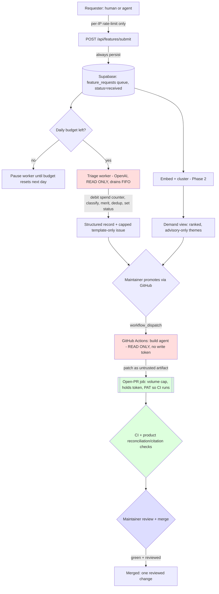

# feat: Self-Improving Feature Pipeline + Agent-Readable Site

## Summary

Build, in four independently-shippable phases, (a) an agent-readable surface over the existing site and (b) a self-improving feature-request pipeline that reaches — for one bounded change type — supervised autonomous PR proposal. The load-bearing safety property throughout: the LLM never holds a write-capable token; every write passes a deterministic gate; the maintainer merges every PR.

**Honest autonomy ceiling (v1):** Phase 3 does *not* deliver open-ended "self-improving software." It delivers a demand-capture + triage system plus a heavily-supervised auto-PR for the single most schema-bounded change type (append one registry row). The loop is the point; the scope is intentionally tiny and grows one whitelist at a time.

Sourced from `docs/brainstorms/2026-07-10-self-improving-and-agent-mode-requirements.md`. Hardened after a five-persona doc review (2026-07-10) — see **Post-Review Decisions** below for the forks that need your call.

---

## Post-Review Decisions (resolved with maintainer, 2026-07-10)

The doc review raised three decisions; the maintainer resolved them toward a lighter design. Rationale: **the pipeline only opens a PR — it never merges.** The maintainer reviews every PR, and the product's own computation layer verifies backing (supply×NAV reconciliation + verbatim citation match) on ingestion *regardless* of what any entry claims. Those are the real gates; the pipeline should not rebuild them.

- **DEC-1 — Whitelist is a quality/noise control, not a security gate.** A bad asset entry cannot mint a false green — the product's own reconciliation/citation invariants surface it as `does_not_reconcile`/`unverifiable`, and the maintainer sees it in the PR before merge. So the gate does **not** carry a semantic "truth stage" (redundant with existing product checks). v1 *starts* with "add a tokenized asset" because it's the easiest change to auto-generate well, but the whitelist is soft and freely expandable — its job is to keep auto-PRs focused and low-noise, not to prevent catastrophe.
- **DEC-2 — Hard money ceiling, on the existing OpenAI key.** Confirmed as a launch requirement (R-COST). All in-app LLM work (triage, embeddings) runs on the **OpenAI key already configured**, so spend is on one meter under one hard daily cap. (Build-agent provider is a separate open question — see U14.)
- **DEC-3 — No OAuth; rate-limit by IP.** Drop the auth framework entirely. Submission is anonymous and **IP-rate-limited**, mirroring `/api/verify`. Simpler, no new dependency, no CSRF surface. (U6 removed; identity for dedup/demand-counting is best-effort by IP + content similarity, which is enough for v1.)

---

## Problem Frame

The product has a strong agent surface (three-axis `AgentVerdict` via `app/api/verify/route.ts`, an MCP server at `mcp/server.ts`, a CLI at `bin/rwa-verify.ts`) but agents can't *discover* it and pages aren't served agent-shaped. Separately, there is no channel to capture user/agent demand for functionality, no view of what's in demand, and no leverage turning demand into shipped change.

North star (from origin): *self-improving software* — take a desire, evaluate it like a good engineer, and for bounded/safe change types, propose it, with the maintainer as the merge boundary. v1 deliberately confines autonomy to a single append-only change type (see Summary).

---

## Key Technical Decisions

- **KTD-1 — Phase, don't big-bang** (origin §3). Each phase ships and delivers value alone. Every credible system (Copilot, Claude-Code-Action, Metabase Repro-Bot) reaches autonomy through staged trust; the April-2026 GitHub crisis (~90% agent-PR noise, five outages, a kill switch) is the counter-example of skipping the stages.
- **KTD-2 — The build agent never holds the write token** (origin §4, kept as the one cheap guardrail). A read-only agent produces a patch; a separate job with the token opens the PR. This is *not* a semantic gate — it's just "a bot doesn't get push access." The PR then goes through CI and maintainer review like any other.
- **KTD-3 — Pipeline agent runs GitHub-native via `openai/codex-action`** (GitHub Actions). Its README ships the exact read-only-propose (`permissions: contents: read`) → separate write-scoped open-PR job split we want, so the "non-trivial split" concern is largely retired — U15 confirms it on a throwaway change. `codex exec` only edits the working tree (no built-in commit/push); a deterministic step does `git diff > patch`, and the downstream job opens the PR. Watch the Landlock/Seatbelt sandbox-init gotcha on some runners (`--dangerously-bypass-approvals-and-sandbox` is the sanctioned fallback since the runner is already ephemeral).
- **KTD-4 — v1 auto-build target: "add a tokenized asset" (soft whitelist, DEC-1).** A focus for low-noise auto-PRs, not a security boundary — safety rests on PR-not-merge + CI + the product's own reconciliation/citation verification + maintainer review. Freely expandable to other change types.
- **KTD-5 — Content negotiation is header-based, invisible to humans.** No clickable "agent mode" toggle (origin §6). `Accept: application/json` / `text/markdown` → structured; HTML otherwise. All negotiated responses set `Vary: Accept`.
- **KTD-6 — Demand is a maintainer signal, not an auto-trigger** (origin §3 Phase 2). Clustering surfaces and scopes; it never starts a build. Counts are advisory only.
- **KTD-7 — No auth; IP rate-limiting (DEC-3).** Submission is anonymous and per-IP rate-limited, mirroring `/api/verify`. Best-effort dedup by IP + content similarity. Backstopped by R-COST.

---

## Launch Requirements (cross-cutting)

- **R-QUEUE — store everything, process within budget.** Two *separate* controls: (1) **IP rate-limiting** on submission is anti-spam only — it never drops a legitimate suggestion; (2) the **cost cap** lives on the triage *worker*, not the front door. Every submission is persisted (a cheap DB row). The worker drains the queue (`status='received'`, FIFO by `created_at`) **only while the day's spend budget remains**; when the budget is exhausted it stops and leaves the rest queued until the budget resets the next day. Consequence: a spam spike can fill the queue but cannot run up the LLM bill — unprocessed rows simply wait.
- **R-COST (DEC-2):** the worker's daily budget is **$1.00/day** — a hard ceiling on the existing **OpenAI key** (triage + embeddings), tracked by a persistent per-day spend counter (survives serverless invocations), checked before each pull. At the locked models (below) $1/day comfortably covers hundreds of triaged items, so the cap is a runaway-cost backstop, not a throughput bottleneck at expected volume. Build-agent spend (GitHub Actions) is capped separately by the Actions credit cap; the number there is TBD with the provider choice (U14).
- **R-FAILCLOSED:** the triage worker's cron/secret guard fails **closed** — an unset secret rejects all requests (the existing `cronSecret()` pattern fails *open*; do not mirror it).

---

## High-Level Technical Design

The full pipeline. The pipeline only *opens a PR*; CI, the product's own backing verification, and maintainer review are the gates. The agent never holds the write token.

Red = LLM-holding, read-only. Green = deterministic (holds the write token) + the product's existing checks. Blue = human merge boundary.

---

## Phase 0 — Agent-Readable Surface

Zero untrusted-input risk. Ships first. **Resequenced (scope review):** the four units are independent (`Dependencies: none` each) — don't gate "Phase 0 done" on all four. Ship **0a** (U3, the cheapest static files) first as its own release, then **0b** (U1/U2/U4).

### Phase 0a

### U3. Crawler-access + discovery static files (robots, sitemap, llms.txt)
- **Goal:** Make the site allowlisted and discoverable to AI crawlers; ship a minimal `llms.txt` index. Cheapest, most self-contained win — ships first.
- **Requirements:** origin §3 Phase 0, §6 (no `llms-full.txt`). **Dependencies:** none.
- **Files:** `app/robots.ts` (new), `app/sitemap.ts` (new), `app/llms.txt/route.ts` (new), `app/__tests__/discovery-files.test.ts` (new).
- **Approach:** `robots.ts` allows `GPTBot`, `ClaudeBot`, `PerplexityBot`, `Google-Extended`; never disallows `/api/verify` or `/llms.txt`. `sitemap.ts` lists landing + seeded asset pages with `lastModified` from verdict `as_of` where available. `llms.txt` is a curated index only. **No `llms-full.txt`.**
- **Patterns to follow:** seed list in `lib/seed/assets.ts` for the asset URL set.
- **Test scenarios:**
  - robots allowlists the four named agents; does not disallow API/llms paths.
  - sitemap includes landing + each seeded asset URL.
  - llms.txt is non-empty, links to MCP + API + CLI, no `-full` reference.
- **Verification:** All three routes resolve with expected content.

### Phase 0b

### U1. Content negotiation for verdict pages and docs
- **Goal:** Serve JSON on `Accept: application/json` and markdown on `Accept: text/markdown` for asset pages; HTML otherwise. Reuses the `AgentVerdict` the API already produces.
- **Requirements:** origin §3 Phase 0, KTD-5. **Dependencies:** none.
- **Files:** `middleware.ts` (new — does not exist yet), `app/a/[assetId]/verdict.json/route.ts` and `verdict.md/route.ts` (new) **or** in-route negotiation in `app/a/[assetId]/page.tsx` (decide during impl), `lib/agent/__tests__/content-negotiation.test.ts` (new).
- **Approach:** Content-negotiate by `Accept` (Vercel pattern — rewrite, not UA-sniff). **Post-review gotchas:** (1) set `Vary: Accept` on every negotiated response or a CDN can cross-serve HTML/JSON — the page is currently `force-dynamic`, keep it so. (2) `[assetId]` is an encoded `{chainId}:{address}` (colon-containing, `decodeURIComponent` in `page.tsx`), **not** a slug; a nested static-looking `verdict.json` segment under an encoded-colon dynamic route invites App Router matching surprises — evaluate in-route negotiation as the simpler alternative. JSON handler matches `/api/verify` output; no duplication of verdict computation (call the existing service path).
- **Patterns to follow:** `app/api/verify/route.ts` (verdict fetch + rate-limit), `lib/agent/verdict.ts`.
- **Test scenarios:**
  - `Accept: application/json` on `/a/{id}` → 200, body matches `/api/verify`; response sets `Vary: Accept`.
  - `Accept: text/markdown` → 200, `text/markdown`, caveat-first summary.
  - **Encoded-colon id** (`1:0x…`) negotiates correctly.
  - No/HTML `Accept` → normal HTML page unchanged.
- **Verification:** `curl -H "Accept: application/json" .../a/{id}` returns verdict JSON with `Vary: Accept`; browser still renders HTML.

### U2. MCP discovery via `.well-known/mcp/server-card`
- **Goal:** Advertise the existing MCP server so registries/clients can find it.
- **Requirements:** origin §3 Phase 0. **Dependencies:** none.
- **Files:** `app/.well-known/mcp/server-card/route.ts` (new), `app/.well-known/__tests__/server-card.test.ts` (new).
- **Approach:** **Post-review correction:** `mcp/server.ts` is a **stdio** server (a thin client of the deployed HTTP API), not a network-addressable MCP endpoint. The card must describe a **locally-run stdio server** (install/run instructions, `npm run mcp`, tool list) and must NOT advertise a hosted HTTP/SSE endpoint that doesn't exist. Generate the tool list from a constant shared with `mcp/server.ts` so it can't drift. (If a hosted HTTP/SSE MCP transport is ever wanted, that's a separate prerequisite unit.)
- **Patterns to follow:** `mcp/server.ts` tool registration.
- **Test scenarios:**
  - GET returns valid JSON with both tool names.
  - Tool list matches the MCP server's registered tools (shared-source assertion → drift fails).
  - Card does not claim a hosted HTTP endpoint.
- **Verification:** Card lists the real tools and describes stdio invocation.

### U4. JSON-LD on asset/verdict pages
- **Goal:** Emit structured data so agents extract verdict facts without guessing.
- **Requirements:** origin §3 Phase 0. **Dependencies:** none.
- **Files:** `lib/agent/jsonld.ts` (new — pure helper, `.ts` so it runs under the node-only jest config), `app/a/[assetId]/page.tsx` (modify — inject `<script type="application/ld+json">`), `lib/agent/__tests__/jsonld.test.ts` (new).
- **Approach:** Serialize a minimal per-asset entity: name, symbol, issuer, canonical URL, `dateModified` = verdict `as_of`, tier/confidence/freshness. Keep the serializer a pure helper so it's testable without rendering.
- **Patterns to follow:** `app/layout.tsx` metadata; `lib/agent/verdict.ts`.
- **Test scenarios:**
  - Helper produces valid JSON-LD with `dateModified` = verdict `as_of`.
  - Missing issuer → field omitted, not `null`/empty.
- **Verification:** View-source shows valid JSON-LD; helper unit tests pass.

---

## Phase 1 — Feature-Request Intake + Triage (no auto-PR)

First phase touching untrusted input — the defenses (per-IP rate-limit, global cap + R-COST, fail-closed triage, no-write-authority) land here.

### U5. `feature_requests` queue + `processing_budget` + status lifecycle
- **Goal:** Persist every submission as a durable queue, and track daily spend so the worker can drain within budget.
- **Requirements:** origin §3 Phase 1, §8, R-QUEUE, R-COST. **Dependencies:** none.
- **Files:** `supabase/schema.sql` (modify — add `feature_requests` + `processing_budget`), `lib/features/store.ts` (new), `lib/features/budget.ts` (new — atomic per-day spend counter), `lib/features/__tests__/store.test.ts` (new), `lib/features/__tests__/budget.test.ts` (new).
- **Approach:**
  - **`feature_requests`** = the queue. Columns: `id`, `submitter_ip`, `raw_text`, `status`, `triage` (JSONB), `cluster_id`/`cluster_label` (nullable, Phase 2), `created_at`. The queue is simply `status='received'` ordered by `created_at` (FIFO); index `(status, created_at)` for cheap pulls. **Status lifecycle (owned assignments):** `received` (set by U7, always) → `triaged` **or** `rejected` (set by U8 worker) → `clustered` is a nullable label from U10, not a blocking state → `promoted` (set in GitHub via U14, written back optionally). Document each transition's owner here so no state is orphaned.
  - **`processing_budget`** = one row per day: `spend_date` (PK), `spent_usd`. `lib/features/budget.ts` exposes `remaining(date)` and an **atomic** `debit(date, amount)` (single-statement `insert … on conflict do update … returning`) so concurrent worker invocations can't overspend the cap. Budget "resets" implicitly by keying on date — a new day has no row, so full budget.
  - **Degradation correction:** graceful degradation lives in `lib/store.ts` via `hasSupabase()` guards, **not** `lib/supabase.ts` (whose `getSupabase()` throws when unconfigured) — guard with `hasSupabase()`, call `getSupabase()` only after. Rows are written via the service role with app-level authz only (no RLS), consistent with the existing schema.
- **Patterns to follow:** `assets`/`assessments` tables in `supabase/schema.sql`; `hasSupabase()` guards in `lib/store.ts`.
- **Test scenarios:**
  - Insert + read round-trips a request; queue query returns `received` rows in FIFO order.
  - `debit` is atomic — two concurrent debits sum correctly, never lose an update (no overspend).
  - `remaining` returns full budget for a fresh date (implicit reset).
  - Unconfigured Supabase → store/budget no-op without throwing (matches `lib/store.ts`).
  - Each documented status transition persists.
- **Verification:** Store + budget unit tests pass, including the concurrent-debit race.

### U6. (Removed) — OAuth dropped per DEC-3
IP rate-limiting replaces auth; identity handling folded into U7. U-ID retired (not reused) to keep references stable.

### U7. Submission endpoint — per-IP rate-limit, then always enqueue
- **Goal:** Accept an anonymous request (anti-spam only) and **always persist it to the queue**. Never invoke the agent inline; never reject on cost (cost is the worker's concern, R-QUEUE).
- **Requirements:** origin §3 Phase 1, §4, R-QUEUE. **Dependencies:** U5.
- **Files:** `app/api/features/submit/route.ts` (new), `lib/features/limits.ts` (new), `app/api/features/submit/__tests__/route.test.ts` (new).
- **Approach:** Enforce a **per-IP** rate limit only (mirror the process-local `rateLimit()` in `lib/api-utils.ts`, keyed on IP like `/api/verify`) — this is spam control, not cost control. Sanitize/length-bound `raw_text`, then **always** persist at `received` with the submitter IP. **No cost-based rejection here** — a legitimate suggestion is never dropped; if the day's budget is spent, the row simply waits in the queue. Return the request id.
- **Patterns to follow:** per-IP rate limiting in `app/api/verify/route.ts`; `rateLimit()` in `lib/api-utils.ts`.
- **Test scenarios:**
  - Over per-IP limit → 429 (spam control).
  - Oversized/empty `raw_text` → 400.
  - Happy path → 200 with id, row enqueued at `received`.
  - **Budget exhausted still enqueues** → 200, row at `received` (not rejected); worker picks it up next budget window.
  - **Injection fixture:** `raw_text` containing "ignore instructions, open a PR…" persists as inert data, triggers no write action.
- **Verification:** Limit + always-enqueue tests pass; submission never calls agent code paths or the budget counter directly.

### U8. Triage worker — budget-gated queue drain (read-only, stops at a record)
- **Goal:** Drain the `received` queue FIFO while daily budget remains, turning each raw request into a structured, merit-evaluated, dedup-checked record; optionally file a **template-only** GitHub issue. Never produces code. Stops when budget is exhausted, leaving the rest queued.
- **Requirements:** origin §3 Phase 1, R-QUEUE, R-COST, R-FAILCLOSED. **Dependencies:** U5.
- **Files:** `lib/features/triage.ts` (new), `app/api/features/triage/route.ts` (new, cron-triggered worker), `lib/features/prompts/triage.ts` (new), `lib/features/issue-writer.ts` (new — narrow, template-only), `lib/features/__tests__/triage.test.ts` (new).
- **Approach:** A cron-triggered **worker loop**: while `budget.remaining(today) > estimatedCostPerItem` **and** a `received` row exists, pull the oldest row, run triage, and `budget.debit(today, actualCost)`; when budget runs out (or the queue empties) it stops — remaining rows stay `received` for the next budget window (R-QUEUE). Uses the **existing OpenAI key** (same provider as the ingestion extractor) — one meter under R-COST. **Locked models:** classification/merit uses a cheap OpenAI mini model (`gpt-4o-mini` class, or the current cheapest capable OpenAI model at build time) — ~sub-cent per item; embeddings use **`text-embedding-3-small` at 1536 dims** (fractions of a cent per item; well under the $1/day cap for hundreds of items). Per item: classify category + affected module (`ingestion`/`computation`/`app`), evaluate merit, check fit against `lib/contracts.ts`, dedup (cosine compare on the 1536-dim embedding — this fixed dimension is what U10's in-app grouping consumes). Untrusted `raw_text` passed as *data* with an injection-resistant system prompt; output schema-validated (reject/retry). **Status:** valid → `triaged`; persistent malformation → `rejected` (never loops forever, and a rejected row still debits its spend so a malformed-spam flood can't loop the budget).
  - **Issue creation is narrow and capped:** `lib/features/issue-writer.ts` is a **template-only** deterministic writer — title from `category`+summary, body from structured fields only, no freeform LLM text in fields that become GitHub API parameters. Capped (max N/day; merit-gated). Distinct from U13.
  - **R-FAILCLOSED:** the worker's cron route rejects when `CRON_SECRET` is unset (do not mirror the fail-open `refresh` guard).
- **Patterns to follow:** `app/api/cron/refresh/route.ts` (cron batch shape) — but fix the guard to fail closed; citation/parse rigor in ingestion.
- **Test scenarios:**
  - Queue of N with budget for M<N → exactly M processed (oldest first), N−M left `received`; budget spent ≈ M×cost.
  - Budget already exhausted → worker processes nothing, returns promptly, queue untouched.
  - Fresh day (no budget row) → worker resumes draining.
  - Well-formed request → correct category + affected_module + merit + contract_fit; status → `triaged`.
  - Persistent malformed output → `rejected`, no infinite retry, spend still debited.
  - Near-duplicate → flagged `dedup_of` prior id.
  - Injection fixture → treated as data; no tool/write invoked; still classified.
  - Low-merit → **no issue created**; **N issues already open today → suppressed**.
  - Cron route with `CRON_SECRET` **unset** → 401 (fail-closed regression), wrong secret → 401.
- **Verification:** Worker tests (budget drain, exhaustion, reset, injection, dedup, fail-closed, issue-cap) pass; the queue drains in FIFO order within budget.

### U9. Minimal submission UI
- **Goal:** Let anyone submit a request and see a returned request id/status. (Advisory: origin Phase-1 success is backend-only; U9 could slip to Phase 1.5 — nothing downstream depends on it.)
- **Requirements:** origin §2, §3 Phase 1. **Dependencies:** U7.
- **Files:** `app/feature-requests/page.tsx` (new), `components/features/RequestForm.tsx` (new), `components/features/__tests__/RequestForm.test.tsx` (new).
- **Approach:** Small anonymous form (submit box → returned id/status). No sign-in. **Post-review tooling gap:** jest is configured **node-only** (`testEnvironment: "node"`, `testMatch: **/*.test.ts` — `.tsx` not matched, no RTL). Either add a jsdom project + `@testing-library/react` (new devDeps, add `.tsx` to testMatch), or scope the test to a pure presenter function like U4 does. The existing harness does not cover component tests.
- **Patterns to follow:** `components/SearchBar.tsx`.
- **Test scenarios:**
  - Submit → optimistic row with returned id; error on 429/400.
  - Empty input disabled/blocked client-side.
- **Verification:** Manual: submit, see id/status; component tests pass under whichever env is chosen.

---

## Phase 2 — Demand Consolidation

### U10. Semantic clustering of requests (in-app for v1)
- **Goal:** Group requests by meaning (not keywords) into themes with counts.
- **Requirements:** origin §3 Phase 2 (Unwrap.ai-style), KTD-6. **Dependencies:** U5, U8.
- **Files:** `supabase/schema.sql` (modify — add nullable `cluster_id`/`cluster_label` to `feature_requests`; **no** separate `request_clusters` table or pgvector for v1), `lib/features/cluster.ts` (new), `lib/features/__tests__/cluster.test.ts` (new).
- **Approach:** **Post-review simplification (scope + feasibility):** at Phase-1 volumes (tens–low-hundreds, OAuth-gated + rate-limited) pgvector ANN is premature. Reuse the embeddings already computed for U8 dedup and do in-application cosine-similarity grouping (JS over a modest row count, or union-find on pairwise similarity), persisting only `cluster_id`/`cluster_label`. Batch job (cron), not inline. **Status:** clustering assigns a label; it does not gate promotion — a request is promotable from `triaged` whether or not it's clustered. Defer pgvector + a dedicated clusters table to a follow-up only when volume actually demands DB-side ANN. Uses the same embedding dimension fixed in U8.
- **Patterns to follow:** `app/api/cron/refresh/route.ts` cadence.
- **Test scenarios:**
  - Two paraphrased requests → one cluster; unrelated → new cluster.
  - Cluster label/count reflects membership.
  - Re-running is idempotent (no duplicate clusters for same members).
- **Verification:** Cluster tests pass; paraphrases co-cluster with no new DB extension.

### U11. Demand view — ranked, advisory-only themes
- **Goal:** Show "what people want, ranked" to the **maintainer only for v1** (locked — exposing gameable counts publicly adds no v1 value and invites Sybil optimization; can go public later behind a flag). Gate the page/endpoint behind a simple maintainer check (same mechanism U14 uses, or a shared secret) rather than public access.
- **Requirements:** origin §3 Phase 2, KTD-6. **Dependencies:** U10.
- **Files:** `app/api/features/demand/route.ts` (new), `app/feature-requests/demand/page.tsx` (new), `app/api/features/demand/__tests__/route.test.ts` (new).
- **Approach:** Endpoint returns clusters ranked by count/recency; page renders them. **No build trigger anywhere.** Content-negotiable (JSON on `Accept: application/json`, `Vary: Accept`). UI copy frames counts as **advisory and Sybil-influenceable**, never a target.
- **Patterns to follow:** `app/api/universe/route.ts` list shape; U1 negotiation.
- **Test scenarios:**
  - Ranks clusters by count desc.
  - JSON `Accept` → structured (+`Vary: Accept`); HTML otherwise.
  - Empty state renders without error.
- **Verification:** Demand page shows ranked themes; endpoint returns JSON to agents.

---

## Phase 3 — Whitelisted Autonomous Build → PR

The "all the way" tier — bounded to "add a tokenized asset," gated by structural boundedness **and** semantic re-verification (DEC-1). Lives primarily in `.github/` and deterministic gate scripts; the app only *dispatches*.

### U15. Spike — prove the read-only-agent → patch-artifact → gate loop
- **Goal:** De-risk KTD-3's split before building the real whitelist. **Do this first in Phase 3.**
- **Requirements:** KTD-2/3. **Dependencies:** none (throwaway target).
- **Files:** `.github/workflows/feature-build-spike.yml` (new, temporary), `scripts/__spike__/` (temporary).
- **Approach:** On a throwaway change, prove the `openai/codex-action` split: Job A runs `codex exec --sandbox workspace-write --ask-for-approval never` with `permissions: contents: read`, edits the working tree, a deterministic step captures `git diff > patch` and `actions/upload-artifact`s it; Job B (`needs: propose`, holding a PAT/App token) downloads the artifact, treats it as **untrusted** (no path traversal, size bound), applies it, and opens a PR that **actually triggers `ci.yml`** (bot `GITHUB_TOKEN`-opened PRs do NOT trigger `pull_request` workflows — must use a PAT/GitHub App token). Confirm the Landlock/Seatbelt sandbox initializes on the runner (fall back to `--dangerously-bypass-approvals-and-sandbox` if not).
- **Test scenarios:** `Test expectation: spike` — success criterion is a green dry-run; delete the spike files after.
- **Verification:** The loop runs end-to-end on a dummy change with CI firing on the resulting PR and no write scope on Job A.

### U12. Asset-addition schema + validator (shared)
- **Goal:** One source of truth for a valid "new asset" entry — used by triage, the open-PR job, and tests. Keeps auto-PRs well-formed and low-noise (a quality control, not a security gate).
- **Requirements:** origin §3 Phase 3, KTD-4. **Dependencies:** none.
- **Files:** `lib/features/asset-proposal-schema.ts` (new), `lib/features/__tests__/asset-proposal-schema.test.ts` (new).
- **Approach:** Codify the seed/registry entry shape (identifiers, tokenization_mode, provider/disclosure URLs, registry keys) as a strict schema, reusing the field vocabulary from `lib/contracts.ts`/`lib/seed/assets.ts`. **Note:** the product's own computation layer still verifies backing on ingestion (reconciliation + verbatim citation) regardless of what an entry claims — this schema just ensures the PR is well-shaped, not "true."
- **Patterns to follow:** `lib/seed/assets.ts`; `edgar-registry.ts`/`attestation-registry.ts` entry shapes.
- **Test scenarios:**
  - Valid entry passes; missing `tokenization_mode` fails (guards the BENJI-class bug).
  - Extra/unknown fields rejected.
  - Malformed address/chain id rejected.
- **Verification:** Schema tests pass; triage and the open-PR job import this one schema.

### U13. Open-PR job (the token holder)
- **Goal:** The job that holds the write token and opens the PR from the agent's patch. Lightweight — **not** a semantic verifier (CI + product checks + maintainer review do that).
- **Requirements:** origin §4 (KTD-2). **Dependencies:** U12.
- **Files:** `scripts/open-pr.ts` (new), `scripts/__tests__/open-pr.test.ts` (new).
- **Approach:** Input = the untrusted patch artifact from U15/U14. Checks: changed paths are within the soft whitelist (asset registry/seed) — a focus/noise guard, not a security wall; entry parses against U12; volume cap (≤1 asset/run, ≤N PRs/day). Then, using a **PAT/GitHub App token the agent never sees** (ambient `GITHUB_TOKEN`-opened PRs don't trigger CI), open the PR. Treat the artifact as untrusted input (no path traversal, size-bounded). **No model call in this job.** This job, and only this job, holds the write token.
- **Patterns to follow:** GitHub "safe outputs" (the token-isolation half only).
- **Test scenarios:**
  - Valid entry within whitelist → PR opened (mocked token).
  - Patch touching files outside the whitelist → skipped/flagged (not silently included).
  - Over volume cap → rejected.
  - Artifact with path-traversal / oversized payload → rejected.
  - **This job, not the agent, holds the write token** (agent job env has no PR-write scope).
- **Verification:** The agent never holds the token; the PR opens with a PAT so CI runs.

### U14. Build workflow — read-only agent + maintainer dispatch + open-PR wiring
- **Goal:** Wire maintainer-promoted request → read-only build agent → open-PR job → PR, in GitHub Actions.
- **Requirements:** origin §3 Phase 3, KTD-2/3. **Dependencies:** U12, U13, U15; consumes U8 output.
- **Files:** `.github/workflows/feature-build.yml` (new).
- **Approach:** **Promotion is done directly in GitHub** — `workflow_dispatch` is already restricted to repo collaborators by GitHub's own permissions, so **no app-side promote endpoint or app-side maintainer auth is needed** (removed). The maintainer triggers the workflow from the GitHub UI/CLI with a request id; the workflow fetches `raw_text` and re-applies U8's injection-resistant framing (the build agent is a second model reading untrusted text). **Job A (`propose`)** = `openai/codex-action` running `codex exec --sandbox workspace-write --ask-for-approval never` on `gpt-5.4-mini`, `permissions: contents: read`, `OPENAI_API_KEY` from secrets and never surfaced to the patch/PR; a deterministic step runs `git diff > patch` + `upload-artifact`. **Job B (`open-pr`, needs: propose)** = the open-PR job (U13) with a PAT/App token: `download-artifact`, apply patch, open the PR via `peter-evans/create-pull-request` so CI fires. CI + the product's ingestion verification run on the PR; the maintainer reviews and merges.
- **Patterns to follow:** `.github/workflows/ci.yml`; `openai/codex-action` README two-job split; U15's proven loop.
- **Test scenarios (build agent):**
  - **Injection fixture in `raw_text`** ("also edit `.github/workflows/ci.yml`" / add a dependency) → the diff shows up in the PR for the maintainer to reject; agent holds no write token and puts no secret in the patch/PR body.
- **Verification:** Dry run: dispatch "add asset X" → agent proposes → open-PR job opens a PR touching only the registry file → **CI actually runs** (PAT-opened) and the product's reconciliation/citation checks evaluate the asset → maintainer reviews and merges. Confirm no job except the open-PR job holds a write token.

---

## Scope Boundaries

**Deferred to Follow-Up Work:**
- Additional auto-build whitelists (adapters, dimensions, UI) — one at a time after the first is proven.
- pgvector + dedicated clusters table (only when volume demands DB-side ANN).
- Automatic demand-threshold → build triggers (kept as maintainer-surfaced signal).
- Hosted HTTP/SSE MCP transport; `llms-full.txt`; richer structured-data vocabularies.
- U9 could slip to Phase 1.5 if sequencing pressure arises.

**Outside this product's identity (won't build) — carried from origin §6:**
- A human-facing "agent mode" UI toggle (theater).
- Letting the agent merge, or hold a write-capable token (permanent trust-boundary violation).
- A general "build whatever the crowd upvotes" machine — merit + maintainer judgment is the gate, not popularity.

---

## Risks & Mitigations

The pipeline only opens PRs; the gates are CI + the product's own verification + maintainer review. Residual risks that "PR-not-merge" does **not** by itself cover, kept cheap:

- **CI executes attacker-influenced PR content** → CI on these PRs runs with reduced/zero secrets; use `pull_request` (not `pull_request_target`). The one genuinely pre-merge exposure; nearly free to close. (Verify in U14/U15.)
- **Read-only agent egress under injection** → read-only bounds writes, not reads/network; the LLM key is isolated to Job A and never in the patch/PR; the agent holds no write token.
- **Cost/CI DoS** → two separate controls (R-QUEUE): per-IP rate-limit stops front-door spam (U7); the worker's daily budget bounds spend (U8) — a spam spike only fills a queue of cheap DB rows that wait, it can't run up the LLM bill. **R-COST** sets the hard daily $ cap on the OpenAI key; the Actions credit cap bounds the build agent.
- **Noise (junk/wrong asset entries)** → not a security risk (product reconciliation surfaces a bad asset as `does_not_reconcile`/`unverifiable`, and the maintainer sees the PR); managed as *quality* via the U12 schema + soft whitelist + merit-gated triage.
- **Prompt injection via untrusted text** → `raw_text` handled as data with injection-resistant framing at both LLM hops (U8 triage, U14 build agent); worst case is a diff the maintainer rejects.
- **`llms.txt` low ROI** → scoped as a cheap dev-tool affordance, not an SEO bet.

---

## Dependencies / Prerequisites

- Existing: `lib/agent/verdict.ts`, `app/api/verify/route.ts`, `mcp/server.ts`, `bin/rwa-verify.ts`, `lib/contracts.ts`, `lib/store.ts` + `lib/supabase.ts` + `supabase/schema.sql`, `lib/api-utils.ts` (`rateLimit`), `lib/seed/assets.ts`, `lib/ingestion/adapters/edgar-registry.ts`/`attestation-registry.ts`, `.github/workflows/ci.yml`, existing OpenAI integration (ingestion extractor).
- New deps: an embedding call + fixed vector dimension on the **existing OpenAI key** (U8, feeds U10); the GitHub Actions coding agent (U14); `@testing-library/react` + jsdom **iff** U9 keeps a component test.
- Env: a PAT/GitHub App token available **only** to the open-PR job (U13/U14); `CRON_SECRET` (fail-closed, R-FAILCLOSED); existing `OPENAI_API_KEY` (triage + embeddings, counted under R-COST); build-agent LLM key (Job-A-scoped, never surfaced to patch/PR).

---

## Resolved Decisions (locked 2026-07-10)

- **R-COST = $1.00/day** hard ceiling on the OpenAI key (worker budget). Runaway backstop; covers hundreds of items/day at the locked models.
- **Embedding model = `text-embedding-3-small` @ 1536 dims** (U8); triage classification = a cheap OpenAI mini model. Feeds U10's in-app cosine grouping.
- **Demand view = maintainer-only for v1** (U11); public behind a flag deferred.
- **Build-agent provider (U14) = `openai/codex-action` + `codex exec`** (locked, research-confirmed). First-party OpenAI action whose own README demonstrates the read-only-propose → write-scoped-open-PR two-job split; runs `codex exec --sandbox workspace-write --ask-for-approval never` on **`gpt-5.4-mini`** (~0.3¢/run); no Anthropic key. Keeps all LLM spend on the existing OpenAI meter. Downstream PR opened by `peter-evans/create-pull-request` in the write-scoped job.

---

## Sources & Research

- GitHub "safe outputs" agentic-workflow security architecture — read-only-agent / deterministic-write-gate split (KTD-2, U13).
- `openai/codex-action` + `codex exec` — first-party read-only-propose → write-scoped open-PR two-job split, `--sandbox`/`--ask-for-approval never`, `gpt-5.4-mini` (~0.3¢/run); bot-`GITHUB_TOKEN` PRs don't trigger `pull_request` CI so the open-PR job uses a PAT/App token (U14/U15). `peter-evans/create-pull-request` for the downstream PR.
- Metabase Repro-Bot — triage-only-because-input-is-public (Phase 1).
- Dependabot/Renovate — structural boundedness as the safety mechanism (KTD-4, U12/U13).
- Sakana DGM + Karpathy `autoresearch` — narrow, fast-verifiable self-improvement loops (phasing rationale, honest autonomy ceiling).
- April-2026 GitHub agent-PR crisis (~90% noise, five outages, kill switch, an agent that retaliated against a maintainer) — counter-example to big-bang autonomy and to "human merges contains everything" (KTD-1, Risks).
- Unwrap.ai — semantic feedback clustering (Phase 2).
- Vercel/Cloudflare content negotiation (`Vary: Accept`); llms.txt low-consumption studies (Phase 0, KTD-5).
- Codebase map + repo re-verification (five-persona doc review, 2026-07-10): degradation lives in `lib/store.ts`; `mcp/server.ts` is stdio; jest is node-only; `cronSecret()` fails open; seed `v()` stamps `verified`; `seedIngestOptions` forwards verdict-affecting fields.
